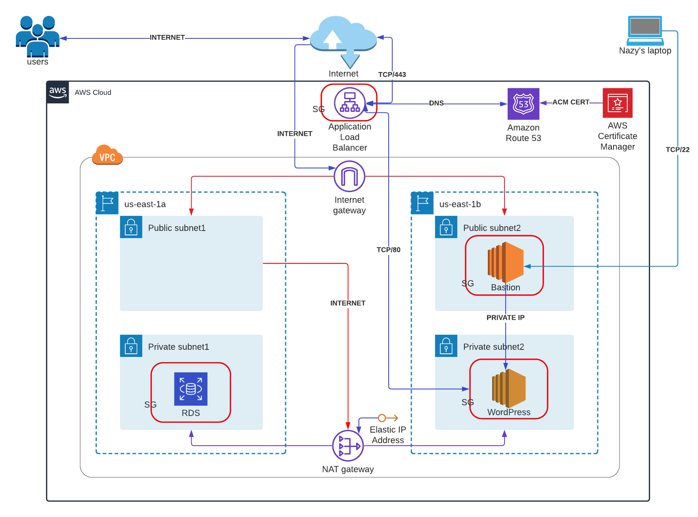

## WordPress on Cloudformation with Bastion host

## Prerequisites:

   - AWS account
   - ACM Certificate (has to be in the same region where you want to create your resources)
   - Domain Name
   - SSH key (created manually for WordPress Instance)
   - VS code
   
## Description

<p>
Template will provision VPC with CIDR block 10.0.0.0/16, 2 Public subnets with CIDR blocks 10.0.1.0/24 & 10.0.2.0/24 and 2 Private subnets with CIDR blocks 10.0.11.0/24 & 10.0.11.0/24. Bastion instance will be on Public subnet us-east-1b and WordPress Instance will be on private subnet us-east-1b, RDS database will be on private subnet us-east-1a. Only access to WordPress Instance is through Bastion Instance, because it will be created with bastion-key (this part will be done manually), and that's the reason why template is separated into two parts. The first part of template create network for the resources VPC, Security groups and Bastion Instance. And the second part of the template will provision WordPress Instance, RDS database, ALB and Route 53. Another important thing is to mention that the second template will use the some resources from the first stack as security groups, VPC and subnet IDs. For that I used two functions:

```
Fn::ImportValue

Fn::Sub
``` 
Resources IDs will be imported from the outputs of the first stack which are alreadu exported on that stack. In Parameters section of the second stack we also created stack name from where resources IDs will be imported. 
</p> 
<p>
Let's configure the network first, we need to bring Internet to VPC and Internet Gateway will solve that and when it gets created it will be attached to VPC. For private subnets Internet comes with NAT Gateway with Elastic IP address (the reason behind it, if we want to do some updates and patches on our website it has to have static IP) and NAT Gateway will get Internet from one of the public subnets, because in that manner our private subnets will be closed to the world. 
</p>
<p>
The next resources are Route tables (public and private) 2 public subnets will be assosiated with  Public-RT attached with Internet Gateway and 2 private subnets will be assosiated with  Private-RT which is attached to Nat Gateway. When VPC gets created with Main route table as well as own security group, which will be named as default. The diagram below will show detailed VPC structure, that I've described above. 
</p> 

The next step is security groups:

  - Bastion Security group with SSH port open to 0.0.0.0/0 (or to my IP address).
  - Load balancer security group  with HTTPS 443 and HTTP 80 ports open to 0.0.0.0/0.
  - RDS security group with MySQL port 3306 open to WordPress host's Security Group. 
  - WordPress host's Security group with port MySQL 3306 open to RDS's Security Group, HTTP port 80 open to ELB Security Group, and SSH port 22 will be open to Bastion Host Securty group.

## WordPress host
<p>
For this Demo we used Amazon LINUX 2 machine (AMI) and t2.micro instance type and user data was added. This bash script will download php, httpd,mysql-agent and Wordpress package and unzippes it.
</p>

### UserData
```
#!/bin/bash
sudo hostnamectl set-hostname wordpress-web
sudo amazon-linux-extras install -y php7.2
sudo yum install -y httpd 
sudo systemctl start httpd
sudo systemctl enable httpd
wget https://wordpress.org/latest.tar.gz
tar -xzf latest.tar.gz
sudo yum install php-gd -y
sudo yum install mysql -y 
sudo systemctl restart httpd
sudo cp -r wordpress/* /var/www/html
sudo chown -R apache:apache /var/www/html
sudo systemctl restart httpd   
```

## RDS database    
<p>
RDS db will be created with an engine MariaDB and version 10.4.8, database instance class, storage type, allocated storage will be chosen from the RDS database parameters. 

Enter RDS db master _```username```_ and _```password```_.

RDS Security group public access will be false for security reason. For learning purposes no backing up ,storage isn't encrypted because db.t2.micro is too small.  
</p>

## Target Group and Application Load Balancer. 

<p>
Target group created with health check enabled, since our target type is "instance" in our case it will be WordPress host, also two Listener Rules (used to be called HTTPSlListener and HTTPlListener depricated from 03.2021 ) both of them forwarded to target group. Application Load Balancer's scheme is internet facing (because we want our customers to see our website), VPC with public subnets  will be chosen otherwise it won’t work. Because only public subnets have internet, if you choose private subnet it will keep hitting your NAT gateway and eventually it will drop it. Enter your ACM Certificate to make your website secure if you have one, if not you need to create it. 
</p>

## Route 53

<p>
The last resource is Route 53, Hosted Zone Name will be available from your hosted zone. Alias target will be copied from  Hosted ZoneID and DNS name. Keep in mind that Hosted Zone Id and Alias Hosted Zone Id is different in every region. On the links section you can see all Regions, Route 53 Hosted Zone IDs (Application Load Balancers, Classic Load Balancers) and Route 53 Hosted Zone IDs (Network Load Balancers).  Another important thing to remember is to put at the end of the line of hosted zone names "." as it shown below, it's AWS requirement.
</p>

```
  Route53:
    Type: "AWS::Route53::RecordSetGroup"
    Properties:
      HostedZoneName: !Sub "${WpHostedZone}."
      Comment: "Zone apex alias targeted to myELB LoadBalancer."
      RecordSets:
      - Name: !Sub "${WpWebDomain}."
        Type: 'A'
        AliasTarget:
          HostedZoneId: !Ref "WebAlbHostedZoneId"
          DNSName: !GetAtt MyALB.DNSName 
```
## Resources

### Network

- Virtual Private Cloud (VPC)
  - Internet Gateway 
  - Nat Gateway
  - 2 Public Subnets
  - 2 Private Subnets 
  - Public Route Table
  - Private Route Table
 
- Security Groups
  - EC2 Security Group for Bastion
  - EC2 Security Group for WordPress
  - RDS Security Group
  - ALB Security Group

- Application Load Balancer

### Application

- EC2 Instance
  - Bastion Instance (Frontend)
  - WordPress (Frontend)
- RDS
  - Database (Backend)

### DNS
- Route 53

## Diagram



## Notes 
<p>
The following  plugins are required to be installed and activated in the WordPress: 
- JSM force ssl
  - JSM's Force HTTP to HTTPS (SSL) – Simple, Safe, Reliable, and Fast!
- Simple 301 redirect 
  - Redirection

These plugins helps you to make your application secure , without redirectiong  your HTTP/80 listener to HTTPS/443.
</p> 

## Useful links

[AWS Cloudformation documetnation](https://docs.aws.amazon.com/cloudformation/)

[AWS Documentation - Hosted Zone IDs](https://docs.aws.amazon.com/general/latest/gr/elb.html)

[Lucid chart for diagrams](https://www.lucidchart.com/pages/)

[Cross-stack output](https://docs.aws.amazon.com/AWSCloudFormation/latest/UserGuide/outputs-section-structure.html)

[Fn::ImportValue](https://docs.aws.amazon.com/AWSCloudFormation/latest/UserGuide/intrinsic-function-reference-importvalue.html)

[Fn::Sub](https://docs.aws.amazon.com/AWSCloudFormation/latest/UserGuide/intrinsic-function-reference-sub.html)

[CloudFormation Compatible Functions](https://docs.openstack.org/heat/queens/template_guide/functions.html)
